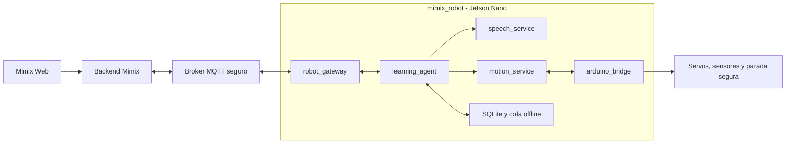

# Mimix Robot

Runtime robótico de Mimix. Convierte los eventos pedagógicos de Mimix Web en una presencia física segura: voz, gestos, movimiento y acompañamiento de la sesión.

> Estado: esqueleto de arquitectura. Aún no controla hardware ni se conecta a Mimix Web.

## Decisiones iniciales

- **Wi-Fi sí, con dos modos.** La Jetson usa el Wi-Fi de la institución y, como respaldo, crea una red propia para una sesión local.
- **La web no se conecta directamente al robot.** El navegador usa el backend de Mimix; el robot mantiene una conexión saliente segura a un broker MQTT.
- **ROS 2 vive dentro del robot.** Coordinará módulos de hardware una vez validada la plataforma Jetson. MQTT será el puente entre Internet y el robot.
- **El robot funciona sin Internet.** Conserva sesiones y eventos en SQLite, interactúa localmente y sincroniza después.
- **Arduino es la capa de seguridad del movimiento.** La Jetson solicita acciones de alto nivel; Arduino aplica límites y parada segura.

## Arquitectura



La especificación está en [docs/ARCHITECTURE.md](docs/ARCHITECTURE.md) y los mensajes iniciales en [docs/PROTOCOL.md](docs/PROTOCOL.md).

## Modos de red

| Modo | Cuándo se usa | Qué permite |
| --- | --- | --- |
| Wi-Fi de la institución (cliente) | Operación habitual | Plataforma alojada, sincronización de eventos y panel en tiempo real. |
| Punto de acceso del robot | No hay Internet o la red es inestable | Los dispositivos se unen a la red del robot y acceden a una experiencia local/caché. Los eventos quedan en cola. |
| Ethernet | Instalación fija, demostración o mantenimiento | Conexión más estable para la Jetson. |

La Jetson Nano no garantiza Wi-Fi integrado en todos los kits; se debe validar un adaptador compatible con Linux y modo AP. NVIDIA documenta las opciones de red por Ethernet y adaptador inalámbrico USB para el kit de desarrollo. [Guía de NVIDIA](https://developer.nvidia.com/embedded/learn/jetson-nano-2gb-devkit-user-guide)

## Estructura prevista

```text
.
├── config/                  # Configuración no secreta de desarrollo
├── deploy/jetson/           # Criterios de despliegue para la Jetson
├── docs/                    # Decisiones de arquitectura y protocolo
├── firmware/                # Código que se compila y flashea al ESP32-C3
│   └── esp32c3_motor_controller/
├── services/
│   ├── arduino_bridge/      # Protocolo serial hacia Arduino
│   ├── learning_agent/      # Estado pedagógico y comportamiento offline
│   ├── motion_service/      # Acciones semánticas -> movimiento seguro
│   ├── robot_gateway/       # MQTT, autenticación y reconexión
│   └── speech_service/      # Voz y diálogo
├── .env.example             # Variables de entorno de referencia
└── docker-compose.dev.yml   # Broker local para desarrollo en PC
```

El firmware se abre desde Arduino IDE seleccionando la carpeta `firmware/esp32c3_motor_controller/`. No se ejecuta dentro de Docker ni de la Jetson.

`services/vision/` es un proceso nativo opcional para la Jetson: procesa la
camara y entrega landmarks a Mimix Web. No forma parte del control de motores
ni transmite video por MQTT. Ver [services/vision/README.md](services/vision/README.md).

## Desarrollo local, por ahora

1. Copiar `.env.example` a `.env` y ajustar solo valores locales.
2. Levantar el broker de prueba con `docker compose -f docker-compose.dev.yml up -d`.
3. Implementar los servicios uno a uno con el contrato de `docs/PROTOCOL.md`.

El broker de desarrollo permite conexiones anónimas **solo** en una máquina local. Nunca debe usarse esa configuración en una escuela ni en producción.

## Hoja de ruta

1. Definir y probar el contrato MQTT con un simulador de robot en la PC.
2. Implementar la cola offline y el agente pedagógico mínimo.
3. Definir protocolo serial y watchdog de Arduino sin conectar motores.
4. Validar voz, red y serial en la Jetson Nano.
5. Decidir ROS 2 tras validar Jetson/JetPack; no se forzará una distribución sin soporte.
6. Integrar movimientos, sensores y despliegue persistente.

## Límites de seguridad

- Ningún mensaje remoto contiene ángulos, PWM ni control directo de servo.
- Todo comando remoto tiene identificador, vencimiento y confirmación.
- La pérdida de Wi-Fi no debe dejar al robot ejecutando un movimiento indefinidamente.
- Arduino debe detenerse en un estado seguro si se pierde serial o falla la Jetson.
